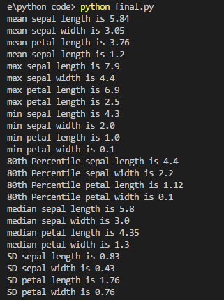
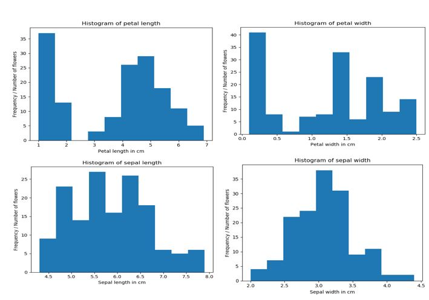
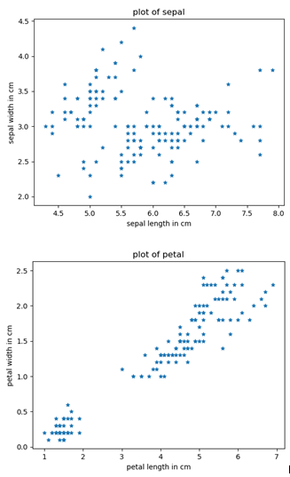

# GMIT-Programming-and-Scripting-Project-2018

This project concerns the well-known Fisher Iris dataset. The project requirements entail researching the dataset and writing documentation and [Python programming language](https://www.python.org) [1] based on that research.

The following are some guidelines for the project content:
1.	Research background information about the data set and write a summary about it.
2.	Keep a list of references you used in completing the project.
3.	Download the data set and write some Python code to investigate it.
4.	Summarise the data set using python scripts (eg. calculate the maximum, minimum and mean of each column of the data set).
5.	Write a summary of your investigations.
6.	Include supporting tables and graphics.

## Background information about the Iris data-set [2]

The Iris flower data-set is a specific set of information compiled by [Ronald Fisher](https://en.wikipedia.org/wiki/Ronald_Fisher),a British statistician and geneticist,in the 1930s. It describes particular biological characteristics of various types of Iris flowers, specifically, the length and width of both pedals and the sepals, which are part of the flower’s reproductive system.

The data set consists of 50 samples from each of three species of Iris (Iris setosa, Iris virginica and Iris versicolor). Four features were measured from each sample: the length and the width of the sepals and petals, in centimetres. Based on the combination of these four features, Fisher developed a [linear discriminant model](https://en.wikipedia.org/wiki/Linear_discriminant_analysis) to distinguish the species from each other.

The Iris flower data set is a [multivariate data set](http://www.camo.com/multivariate_analysis.html) introduced by Fisher in his 1936 paper The use of multiple measurements in taxonomic problems as an example of linear discriminant analysis.

## Use of the Iris data-set
The Iris flower data-set is now widely used as a data-set for testing purposes in computer science.

 - New types of sorting models and taxonomy algorithms often use the Iris flower data set as an input, to examine how various technologies sort and handle data sets. Programmers might, for example, download the Iris flower data set for the purposes of testing a decision tree, or a piece of machine learning software. For this reason, the Iris flower data set is built into some coding libraries, in order to make this process easier [3].

 - The data-set a good example to explain the difference between supervised and unsupervised techniques in data mining , as in its use by the [IBM Watson analytics engine](https://www.ibm.com/communities/analytics/watson-analytics-blog/watson-analytics-use-case-the-iris-data-set/)[4].

 - Based on Fisher's linear discriminant model, this data set became a typical test case for many [statistical classification](https://en.wikipedia.org/wiki/Statistical_classification) techniques in machine learning such as support vector machines [2].

## Preparation required to write python code to analyse the Iris data-set

The following were required before any python scrits were written:

 - Python version 3.6 downloaded (via [Anaconda](https://en.wikipedia.org/wiki/Anaconda_(Python_distribution)))
 - [Microsoft Visual Studio tool](https://en.wikipedia.org/wiki/Microsoft_Visual_Studio) installed
 - Copy of Iris data-set created as a text file in my project folder on my laptop
 - Python libraries imported: csv, pandas, numpy, matplotlib and sklearn
 - Calculations and analysis were performed on the Iris data-set using Python scripts
 
Python libraries are collections of functions and methods that allows you to perform numerous actions and functions. [NumPy](http://www.numpy.org/) is the fundamental package for scientific computing with Python. [Matplotlib](https://matplotlib.org/) is a plotting(or graphing) library for the Python.

## The following calculations and analysis were performed on the data-set
 - Minimum,Maximum and Mean(average) of each feature(length and the width of the sepals and petals)
 - Median(mid-point or 50th percentile) and Standard Deviation(measure of dispersion or how spread out numbers are)
 - 80th percentile of of each feature(this represents relative standing of a particular value,80% of values are lower) 
 - Histogram
 - Scatterplot

The file called [code.py](code.py) contains the python scripts with explanations of code and any relevant references.

Histograms provide a visual interpretation of numerical data by indicating the number of data points that lie within a range of values.  These range of of values are called classes or bins. The frequency of the data that falls in each class is depicted by the use of a bar.  The higher that the bar is, the greater the frequency of data values in that bin [5].

A scatter plot (also called a scatter graph) is a type of plot or mathematical diagram using Cartesian coordinates to display values for typically two variables for a set of data [6].These graphs can show the extent of correlation between 2 variables.

## Summary of my investigation of the the data-set

Based on the analysis as summarised below,the following are the key observations:

 - Comparing the histogram for the 4 features,visually the sepal width is the most evenly distributed and this is confirmed by sepal width having the lowest standard deviation(.43).

 - The petal length has the highest standard deviation(1.76) and looking at the histogram there are 2 seperate goupings within the data,the group of data points on the right of this histogram is evenly distributed.
 
 - The sepal length has the highest mean(average) of 5.84 and this is consistent with sepal length having the highest maximum and minimum.
 
 - Comparing the 2 scatterplots (Sepal v Petal) the pattern of data points in Petal shows a stronger correlation(or realtionship) between length and width.This means as the values of length or width increases the other also increases and visa versa.
 
 - From the output screen-shot below you can see and compare the 80th percentile for each feature,this means that 80% of the measurements are equal to or lower than this value.

 The following is a screen-shot of my python code outputs(calculations and analysis):

The following is a Histogram of the 4 features,output by python scripts via file [code.py](code.py):

The following is a Scatter Graph of the 2 parts(Sepal and Petal) of the Iris flower,output by python scripts via file [code.py](code.py):

# References
1 Python Software https://www.python.org/

2 Iris flower data-set https://en.wikipedia.org/wiki/Iris_flower_data_set

3 https://www.techopedia.com/definition/32880/iris-flower-data-set

4 IBM https://www.ibm.com/communities/analytics/watson-analytics-blog/watson-analytics-use-case-the-iris-data-set/

5 Histogram explained https://www.thoughtco.com/what-is-a-histogram-3126359

6 Scatterplot explained https://en.wikipedia.org/wiki/Scatter_plot

